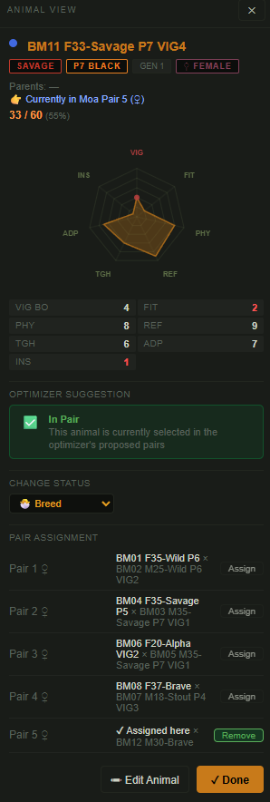
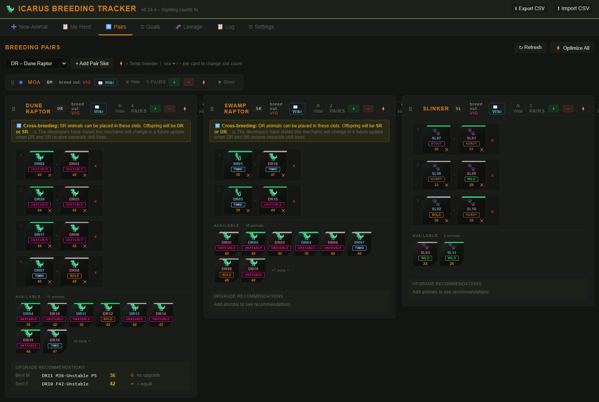
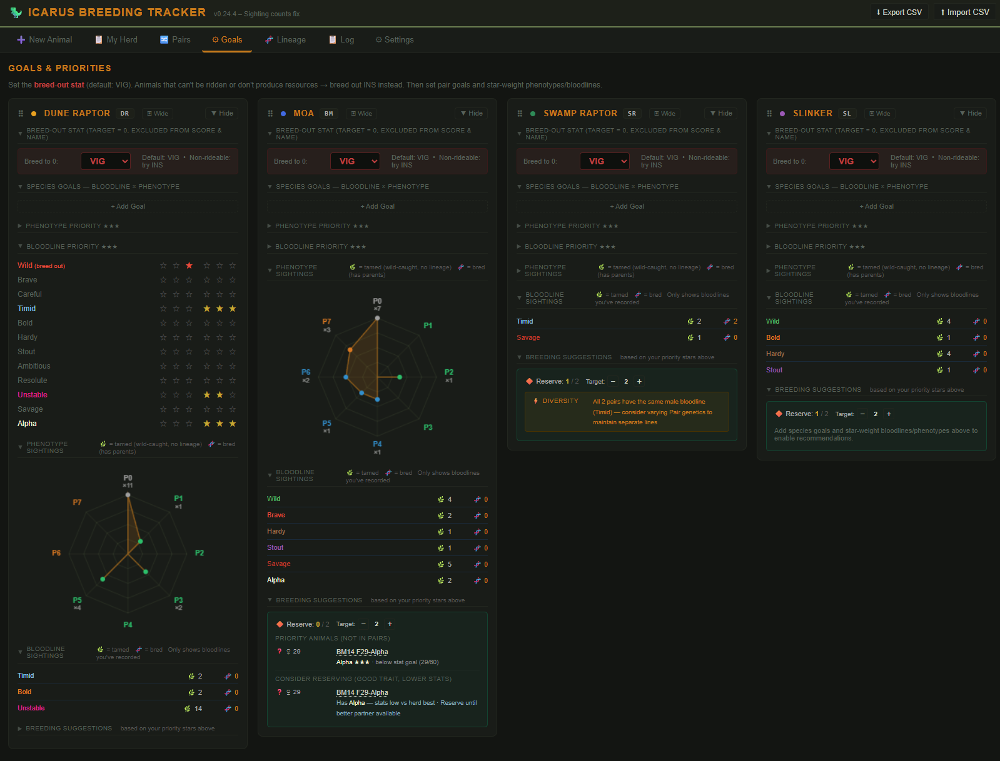
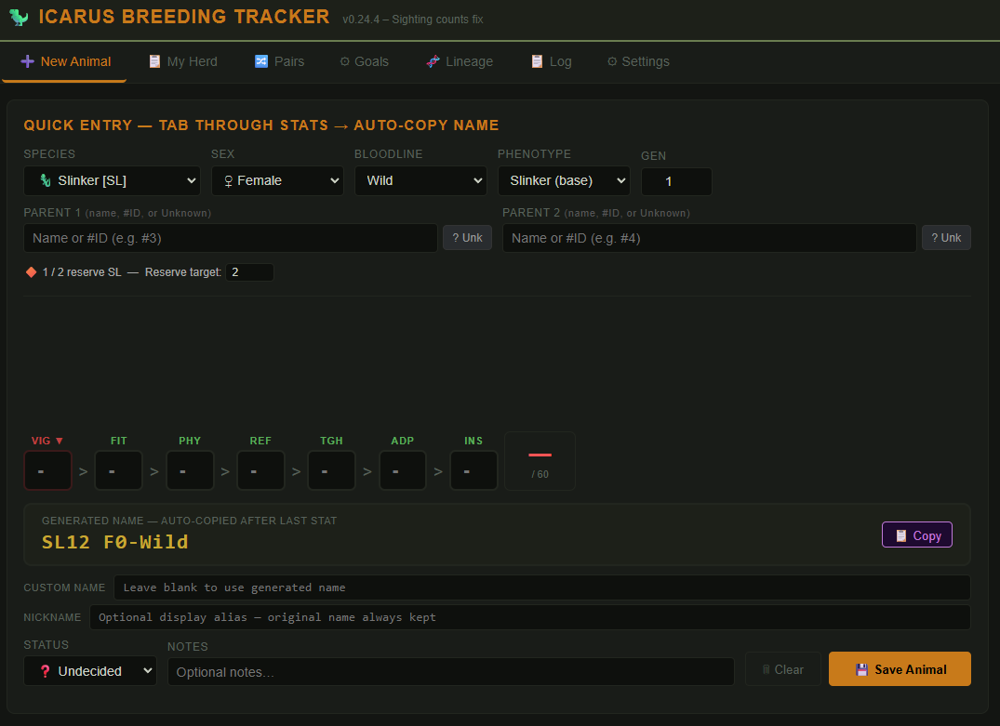
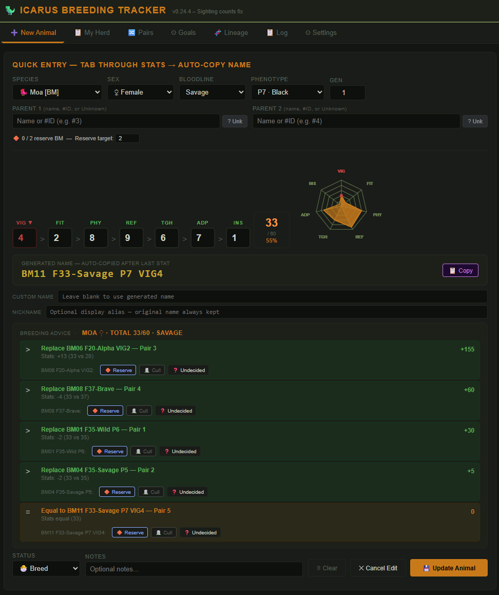
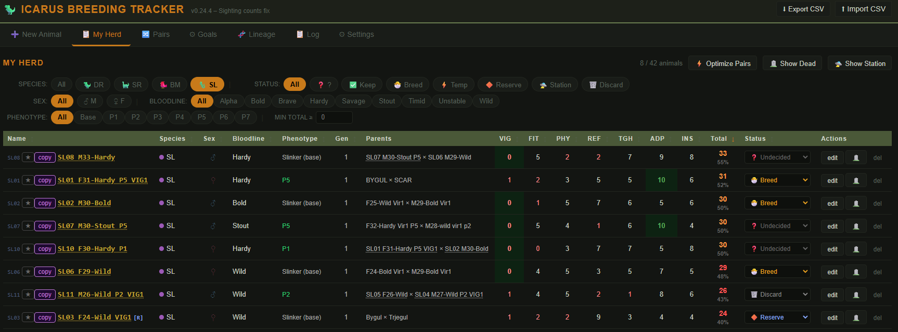
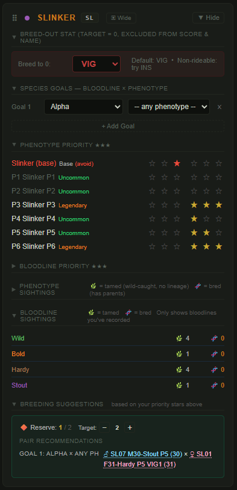

# 🦖 Icarus Breeding Tracker


[](https://ko-fi.com/H2H01XD48Q)

A free, open-source herd tracker and breeding planner for the survival game [Icarus by RocketWerkz](https://store.steampowered.com/app/1149460/Icarus/). Track and manage your tamed animals — Dune Raptors, Geothermal Raptors, Slinkers, Moa and more — plan breeding pairs, optimise bloodlines and phenotypes, and record full lineage history. No install, no account, no internet required.

> **Keywords:** Icarus game animal breeding, Icarus taming tracker, Dune Raptor breeding, Slinker breeding, Icarus herd management, Icarus bloodline tracker, Icarus phenotype guide, RocketWerkz Icarus tool

---

## 🌐 Use the Web Version

The easiest way to use the app is directly in your browser — nothing to download or update:

**https://rnksekmeth.github.io/icarus-breeding-tracker**

The web version is always up to date with the latest features. Your data is saved to a local JSON file on your own computer using the File System Access API — nothing is sent to any server.

> **Browser requirement:** Chrome or Edge (version 86+). Firefox does not support the File System Access API. The app will work in Firefox using browser storage as a fallback, but local file saving requires Chrome or Edge.

Prefer to keep a local copy for offline play or a specific version? See [alternative installation options](#-alternative-download-and-run-locally) at the bottom of this page.

---

## 🚀 First Launch

1. Open the app (web version or local file) in Chrome or Edge
2. A startup screen appears asking how to store your data
3. Click **✨ Start fresh (create new file)**
4. A save dialog opens — pick any folder and save as `herd_data.json`
5. The app is ready to use

On every future visit, the app remembers your file. Click **▶ Continue with herd_data.json** and grant permission when prompted — a one-click step each session.

### Migrating from an older version

If you previously used the app when it stored data in the browser, click **⬆ Migrate data from browser storage** on the startup screen. Your data will be exported to the new file format and the old browser storage will be cleared.

---

## 💾 Saving

The app saves automatically after every change. A small **💾 Saved** indicator appears briefly in the top right to confirm each save. You never need to save manually.

Your `herd_data.json` file can be backed up, copied to another computer, or shared with other players like any regular file.

---

## 📸 Screenshots


*My Herd filtered to Slinkers with the Animal Viewer side panel open*


*Breeding Pairs — tile slots with bloodline badges, phenotype rarity stripes, and the animal pool*


*Goals tab — phenotype sighting radar (P0–P7) and colored bloodline sighting rows*

---

## 📖 How to Use

<details>
<summary><strong>➕ New Animal</strong></summary>



Fill in the species, sex, bloodline, phenotype, generation, stats (VIG, FIT, PHY, REF, TGH, ADP, INS), and optionally the parents. The app generates a name automatically in the format `DR01 55F-Bold P3 VIG2`. Hover over any stat label or column header to see what the stat does.

A **live radar chart** updates as you fill in stats, giving an instant visual of the animal's stat profile before saving.



Two optional name fields are available: **Custom name** replaces the generated name entirely (useful for re-adding a deleted animal at its original ID), and **Nickname** sets a display alias shown throughout the app while keeping the original generated name intact for internal matching.

After saving, a **Place in Breeding Pair** panel appears offering to slot the animal directly into a pair. The app scores all available slots and highlights the best suggestion. If a slot already has an occupant, you can choose what happens to the displaced animal.

</details>

<details>
<summary><strong>📋 My Herd</strong></summary>



Shows all your animals in a sortable, filterable table. Key features:

- **Sort** by any column — click a header once to sort, again to reverse
- **Filter** by species, status, sex, bloodline, phenotype, and minimum total score
- **Change status inline** — each row has a status dropdown; no need to open Edit Animal
- **Edit** an animal with the edit button; a **Cancel** button lets you exit without saving changes
- **⭐ Favorite** — click the star button on any row to mark an animal as a favourite; favourited animals are never suggested for culling by the pair optimizer but can still be moved to reserve or taken out of rotation
- **Nicknames** — if an animal has a nickname set, the nickname is shown in bold and the original generated name appears dimly beside it
- **Click any row** to open the **Animal Viewer** side panel (see below)
- **🪦 Show Dead** / **🛸 Show Station** toggles to include or exclude those animals from the view
- **⚡ Optimize Pairs** button in the section header — opens the pair optimizer for all species (see Breeding Pairs)

</details>

<details>
<summary><strong>🔍 Animal Viewer</strong></summary>


Clicking any animal row, tile, or name anywhere in the app opens the **Animal Viewer** — a persistent panel that slides in from the right without blocking the rest of the UI.

The viewer shows:
- **Badge chips** — bloodline (in its bloodline color), phenotype rarity, sex, and generation at a glance
- **Radar chart** — amber polygon chart of all stat values
- **Full stats** — all seven stats with the breed-out stat highlighted
- **Current pair** and optimizer suggestion for this animal
- **Clickable parents** — if either parent is in your herd, their name is a link that opens their viewer directly
- **Quick actions** — change status, assign to or remove from a pair slot, or jump to the edit form

Close the panel with the **✕** button, or open a different animal to replace it.

</details>

<details>
<summary><strong>🔀 Breeding Pairs</strong></summary>


Set up your active breeding pairs per species. The app enforces global exclusivity — an animal can only appear in one pair slot at a time.

Each pair shows two **tile slots** styled after the in-game item input slots — chamfered tiles (opposing corners cut) for the male ♂ and female ♀ sides. Below the pair slots, an **animal pool** shows all unassigned animals for that species as draggable tiles.

Each tile shows the animal's **short species ID** (e.g. `DR02`), a **colored bloodline badge**, and a **phenotype rarity stripe** along the top edge (grey = base, green = uncommon, blue = rare, orange = legendary).

**Assigning animals:**

- **Drag from pool** — drag a tile from the pool into a male or female slot
- **Drag between slots** — drag directly from one slot to another (including across pairs)
- **Remove** — click the ✕ button on an assigned tile to return the animal to the pool
- **View** — click any tile (pool or slot) to open the animal viewer

When placed in a slot, the animal's status is automatically set to **Breed**. When removed or replaced, their status reverts to **Undecided** — unless you had set it to something else deliberately (Reserve, Station, etc.), in which case it is left as-is. Dune Raptors and Swamp Raptors can be cross-bred; their animals appear in each other's pair slots. Cross-breed offspring are either a DR or SR — determined by which species tab the pair is in.

Each pair slot shows a goal badge:
- **✓ Goal N** — this animal matches one of your species goals
- **⚠ bloodline** — this animal has a negatively-starred trait (see Goals)
- **★★ Bold** — this animal has a positively-starred trait but doesn't directly match a goal

A stat **upgrade recommendation** panel below each species card suggests free animals that would improve the weakest pair slot. If no better animal is available, the panel shows **no upgrade**.

Cards can be collapsed to compact chips using the **▼ Hide / ▶ Show** button, and toggled between Narrow and Wide layout. The grid uses a masonry layout — shorter cards automatically fill the vertical space under taller ones rather than wrapping to the leftmost column. Collapsed state and card width persist across reloads.

**⚡ Optimize Pairs** — available in the section header (all species) and as a small ⚡ button on each species card (single species). The optimizer scores all active animals against your goals, bloodline priorities, and phenotype priorities, then proposes the best M×F assignment for each pair slot. It covers goals first (one pair per goal where possible), fills any remaining slots with the highest-scoring remaining animals, and biases toward bloodline diversity across multiple pairs so separate lines are maintained. A list of suggested status changes for unassigned animals is shown alongside: animals with desired traits but low stats are suggested for Reserve, high-stat animals that don't fit are suggested for Store, and animals with negative traits or no valued traits below the stat goal are suggested for Cull. Animals that are outclassed by a paired same-sex/species animal (with no unique positive traits of their own) are also suggested for Cull — unless they are near-max stat (≥90% of species maximum). Favourited animals are never suggested for culling. You can choose to **Apply Pairs Only** or **Apply All** (pairs + all status suggestions) from the modal.

If a proposed pair animal is currently assigned to a different pair slot, a **⚠ in pair** warning appears in the optimizer row, showing which pair they will be moved from when you apply.

</details>

<details>
<summary><strong>⚙ Goals</strong></summary>



Per-species configuration. Each section can be collapsed or expanded independently, and the collapsed state of both the card and its sections persists across reloads.

**Breed-Out Stat** — the stat you are breeding toward 0 (excluded from the total score and animal name). Default is VIG. For animals that cannot be ridden or don't produce resources, consider INS instead.

**Species Goals** — define what offspring you are trying to produce. Each goal is a target bloodline × phenotype combination (either or both can be left as "any"). Add as many goals as you like. The Breeding Suggestions panel recommends specific pair pairings for each goal.

**Phenotype Priority** — star-rate each phenotype from −3 to +3:
- **+1 to +3 (gold stars)** — desired phenotype; animals with this trait are prioritised for breeding
- **−1 to −3 (red stars)** — undesirable phenotype to breed out; animals carrying it get ⚠ warnings in the Pairs tab, and the suggestions engine avoids pairing two carriers together (to reduce inheritance chance)

**Bloodline Priority** — same −3 to +3 rating for bloodlines. Unstable defaults to ★★ as it provides a breeding multiplier bonus. Setting a bloodline to negative (e.g. Wild −2) will flag carriers and suggest keeping them as temporary breeders only if their stats significantly exceed cleaner alternatives.

**Phenotype Sightings** — a P0–P7 radar chart showing your collection distribution across phenotype tiers. Each axis is one phenotype, the filled area shows relative count (using a square-root scale so rare phenotypes remain visible when you have many of one type), and axis labels show the exact total. Counts include all animals ever recorded, including dead ones.

**Bloodline Sightings** — a list of every bloodline you've recorded, colored in its bloodline color, with separate tamed (🌿) and bred (🧬) counts. Counts include dead animals.

**Breeding Suggestions** — automatically generated based on your priorities:
- *Pair recommendations* — one per species goal, showing the best M × F combination to achieve it
- *Priority animals not in pairs* — high-value unassigned animals that should be placed
- *⚠ Negative-trait temp breeders* — animals with bad traits but stats ≥20% above the best clean alternative; flagged for temporary use with a warning if both parents share the same negative trait
- *Consider reserving* — animals with desired traits but below-average stats, worth holding until a better partner is available
- *✓ Goals achieved* — notifies you when a bred animal in your herd already satisfies a species goal
- *↑ Reserve upgrades* — if a better unassigned animal matches the same desired trait as a current reserve, you are prompted to swap it in
- *⚡ Diversity warning* — if all active pairs share the same bloodline on one side, you are warned to vary the genetics to maintain separate breeding lines

**Reserve target** — use the **−** and **+** buttons to set how many reserve animals you want to maintain per species.

All animals listed in Breeding Suggestions are clickable — click any name to open that animal in the viewer.

</details>

<details>
<summary><strong>🧬 Lineage</strong></summary>

Select any animal to view its family tree up to 4 generations deep. Each node shows stats, bloodline, generation, and inheritance indicators — whether each stat was inherited from the mother, father, improved beyond both parents, or regressed.

The sidebar shows species-level breeding insights: average stat gain per breeding, best performing stat trend, and total recorded animals.

</details>

<details>
<summary><strong>📋 Log</strong></summary>

A fixed banner at the bottom of the page always shows the most recent activity. Click **View log ▶** to jump to the full log.

The **📋 Log** tab (between Lineage and Settings) keeps a chronological history of all activity: animals added or edited, status changes, pair slot updates, deletions, and accepted suggestions. Entries are timestamped and colour-coded by type. Animal names in log entries are clickable and open the viewer directly.

- **Filter pills** — narrow the list to a specific event type: Added, Edited, Status, Pairs, Deleted, or Suggestions
- **Text search** — filter entries by keyword as you type
- **Max entries** — configurable limit (default 100); older entries are trimmed automatically when the limit is reached
- **Clear** — wipe the log history if needed

</details>

---

## 🐾 Status Reference

| Icon | Status | Meaning |
|---|---|---|
| ❓ | Undecided | Newly added, not yet assessed |
| ✅ | Keep | Good animal, part of the herd long-term |
| 🐣 | Breed | Active breeder |
| ⚡ | Temp Breed | Temporary breeder — wrong bloodline but used for a stat boost |
| 🔶 | Reserve | Held in reserve, not currently active |
| 🛸 | On Station | Stored on the space station (transit between maps or safe storage) |
| 🗑️ | Discard | Scheduled for removal |
| 🪦 | Dead/Culled | Deceased — hidden by default, kept in records |

---

## 🧬 Species Reference

| Code | Species |
|---|---|
| DR | Dune Raptor |
| SR | Swamp Raptor |
| BM | Moa |
| SL | Slinker |

---

## 💾 Alternative: Download and Run Locally

If you prefer to keep a local copy (useful for offline play or if you want a specific version):

### Option A — Download the file directly

1. Go to the [repository on GitHub](https://github.com/rnksekmeth/icarus-breeding-tracker)
2. Click `index.html` in the file list
3. Click the **download icon (⬇)** in the top right of the file view
4. Save it to a permanent local folder, e.g. `E:\Icarus\BreedingTracker\index.html`
5. Open it in Chrome or Edge

> Avoid saving to a cloud-synced folder like OneDrive or Google Drive — file syncing can occasionally conflict with auto-save. A local drive is ideal.

### Option B — Clone with Git

```
git clone https://github.com/rnksekmeth/icarus-breeding-tracker.git
```

Pull updates with `git pull` whenever a new version is released.

---

## 💬 Feedback & Bug Reports

Use the **⚙ Settings** tab inside the app for direct links to submit bug reports and feature requests on GitHub. A free GitHub account is required to post, but anyone can view existing issues.

Direct links:
- 🐛 [Report a Bug](https://github.com/rnksekmeth/icarus-breeding-tracker/issues/new?labels=bug)
- ✨ [Feature Request](https://github.com/rnksekmeth/icarus-breeding-tracker/issues/new?labels=enhancement)
- 📋 [View All Issues](https://github.com/rnksekmeth/icarus-breeding-tracker/issues)

---

## 🤝 Sharing the App

Share the `index.html` file directly — it is completely self-contained. Recipients follow the same first launch steps to set up their own data file. Or just send them the web version link.
